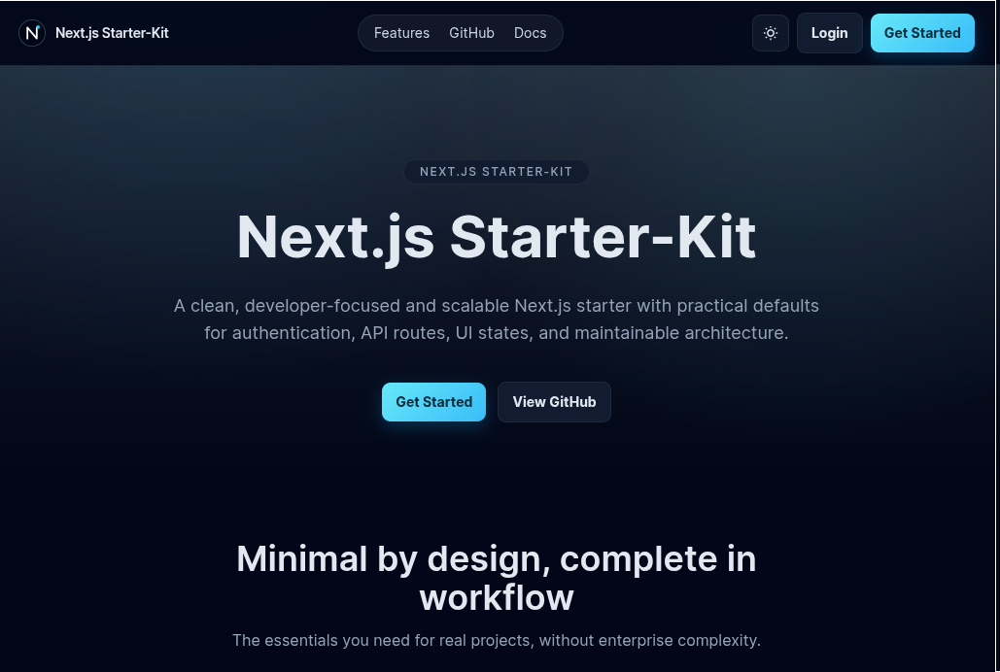

# Next.js Starter Kit – Clean, Minimal, Production-Ready Boilerplate

A polished Next.js starter kit focused on practical defaults, clean architecture, and a great developer experience for real projects.



## Features

- Authentication system (login, register, session, logout)
- Protected app area (Dashboard, Projects, Tasks, Users)
- API routes with consistent success/error response shape
- Modern UI components and polished page states
- Built-in demo support with ready-to-use credentials
- Middleware auth guard for private routes
- Reusable modules + services structure

## Screenshots

### Dashboard


### Login


## Quick Start

1. Clone the repository

```bash
git clone <your-repo-url>
cd Next.js-Starter-Kit
```

2. Install dependencies

```bash
pnpm install
```

3. Set up environment files

```bash
pnpm setup
```

4. Run development server

```bash
pnpm dev
```

5. Open the app

- http://localhost:3000

## Demo Credentials

- Admin: `admin@example.com` / `admin123`
- User: `user@example.com` / `user123`

## Folder Structure (Brief)

```text
src/
  app/                 # Routes and API endpoints
  components/
    layout/            # Layout pieces (navbar)
    landing/           # Landing page sections
    shared/            # Reusable app components
    ui/                # Base UI components
  modules/             # Feature modules + services
  services/            # API client
  lib/                 # Auth, env, error utilities
  styles/              # Global styles
```

## Who Is This For?

- Beginners who want a clean, understandable Next.js foundation
- Developers who need a fast, production-like starting point
- Teams that value readability and consistent project structure

## Author

- A. Z. M. Arif
- Website: https://azmarif.dev
- GitHub: https://github.com/azmarifdev
